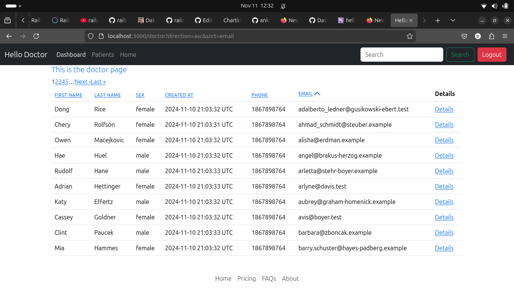

# Hello Doctor

The Recipe app keeps track of patients record. Doctor and receptionist have rseparate dashboard. Receptionist have full CRUD operations over patients record. 

## Screenshot

## Built With

## Entity-relationship diagram
[ERD](erd.pdf)

- Ruby on Rails
- Ruby
- Bootstrap
- HTML & CSS
- JavaScript
- Git
- Rubocop
- Rspec
- OOP

## Getting Started

To get a local copy up and running follow these simple example steps.

- copy this link `https://github.com/david-lafontant/HelloDoctor.git`.
- get the directory that you want to clone the repository.
- open the terminal in this directory.
- run `git clone https://github.com/david-lafontant/HelloDoctor.git`.
- go to the repository folder in your command prompt, run `cd HelloDoctor`.
- run `bundle install`.
- run `yarn install`
- Follow the instruction in the database configuration file : path `config\database.yml` and/or create database in your postgresql called `hellodoctor_development` (this will depend on your configuration)
- run `rails db:prepare` then `rails db:migrate`
- To run the test run `rspec scpec` in your terminal.
- To run the rails server run  `bin/dev` in your terminal.

## Author

👤 **David Lafontant**

- GitHub: [@githubhandle](https://github.com/david-lafontant)
- Twitter: [@twitterhandle](https://twitter.com/manikatex)
- LinkedIn: [LinkedIn](https://www.linkedin.com/in/david-lafontant/)

## 🤝 Contributing

Contributions, issues, and feature requests are welcome!

Feel free to check the [issues page](../../issues/).

## Show your support

Give a ⭐️ if you like this project!

## Acknowledgments

- [Avi Flombaum](https://code.avi.nyc/turbo-sortable-paginated-tables?utm_source=pocket_reader) 

## 📝 License

This project is [MIT](./MIT.md) licensed.

